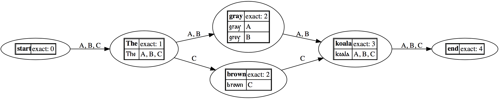
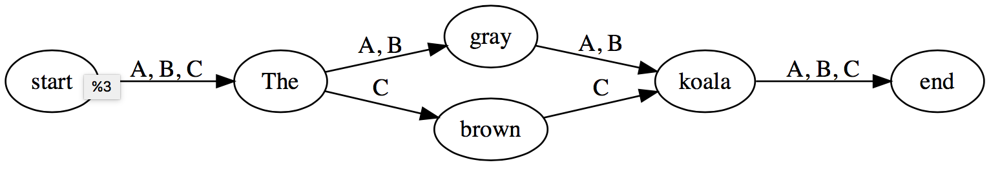

# CollateX Python documentation main page

## Overview

This page documents the _API_ for CollateX Python 2.1.3rc2, with particular attention to the _input_ and _output formats_. 

Information about the _Gothenburg model of textual variation_ and the _variant graph_ data model is available at the main CollateX site at <https://collatex.net>.

Tutorial information about using CollateX Python is available at <https://github.com/DiXiT-eu/collatex-tutorial>. Those materials were written for an earlier release of CollateX Python, and may be superseded in part by the present page.

The latest _stable_ version of CollateX can be installed under Python 3 with `pip install --upgrade collatex` (see below for additional installation information). The latest _development_ version can be installed with `pip install --upgrade --pre collatex`. The CollateX source is available at <https://github.com/interedition/collatex>, where CollateX Python is in the `collatex-pythonport` subdirectory. Instructions for running CollateX Python from within a Docker container are available at <https://github.com/djbpitt/collatex-docker>.
## Installation

Basic installation instructions for CollateX Python are available at <https://github.com/DiXiT-eu/collatex-tutorial/blob/master/unit1/Installation.ipynb>.

In order to render variant graphs in the Jupyter Notebook interface (which is optional), you must intall both the Graphviz stand-alone program and the `graphviz` Python package. Graphviz (the stand-alone program) installation has been simplified since the time the basic installation instructions were written; use the newer method at <https://graphviz.gitlab.io/download/>. Install the `graphviz` Python package with `pip install graphviz`.

## Getting started

Import and use the CollateX Python package as follows:

```python
from collatex import *
collation = Collation()
collation.add_plain_witness("A", "The quick brown fox jumps over the dog.")
collation.add_plain_witness("B", "The brown fox jumps over the lazy dog.")
alignment_table = collate(collation)
print(alignment_table)
```

The preceding reads plain-text data, applies default tokenization and normalization, aligns the witnesses, and outputs an ASCII alignment table (see below). As described at <https://github.com/DiXiT-eu/collatex-tutorial>, you can replace the default tokenization and normalization with methods customized to fit the shape of your data, and you can read input from files, instead of specifying it literally. These procedures are not described further in this document. The input and output formats supported by CollateX Python are described below, as are the parameters that control the alignment process.

## Alignment parameters

The first argument to the `collate()` function is the name of the `Collation` object. The `output`, `layout`, and `indent` parameters control the shape of the output, and are discussed below. There are also two parameters that control the way the alignment is performed or rendered independently of output format: `segmentation` and `near_match`. Both take Boolean values (`True` or `False`).

### The `segmentation` parameter

The `segmentation` parameter determines whether each token is output separately (`False`) or whether adjacent tokens that agree in whether they include variation or not are merged into the same output node or cell (`True`). The default is `True`, so `collate(collation)`, using the sample input above, produces output like:

```
+---+-----+-------+--------------------------+------+------+
| A | The | quick | brown fox jumps over the | -    | dog. |
| B | The | -     | brown fox jumps over the | lazy | dog. |
+---+-----+-------+--------------------------+------+------+
```

while `collate(collation, segmentation=False)` produces:

```
+---+-----+-------+-------+-----+-------+------+-----+------+-----+---+
| A | The | quick | brown | fox | jumps | over | the | -    | dog | . |
| B | The | -     | brown | fox | jumps | over | the | lazy | dog | . |
+---+-----+-------+-------+-----+-------+------+-----+------+-----+---+
```

### The `near_match` parameter

Understanding _near matching_ (also called _fuzzy matching_) requires understanding how CollateX Python performs alignment. By default, CollateX aligns only tokens that are string-equal (after normalization). Additionally, some non-matching tokens may wind up aligned because they are sandwiched between matching tokens; we call this a _forced_ match. For example:

```python
from collatex import *
collation = Collation()
collation.add_plain_witness("A", "The gray koala")
collation.add_plain_witness("B", "The brown koala")
alignment_table = collate(collation)
print(alignment_table)
```

outputs

```
+---+-----+-------+-------+
| A | The | gray  | koala |
| B | The | brown | koala |
+---+-----+-------+-------+
```

Although “gray” and “brown” are not string-equal, they are forced into alignment because they are sandwiched between exact matches at “The” (before) and “koala” (after). 

The `near_match` parameter controls the behavior of CollateX Python in some situations where no exact alignment is possible. Consider:

```python
from collatex import *
collation = Collation()
collation.add_plain_witness("A", "The big gray koala")
collation.add_plain_witness("B", "The grey koala")
alignment_table = collate(collation, segmentation=False)
print(alignment_table)
```

which outputs

```
+---+-----+------+------+-------+
| A | The | big  | gray | koala |
| B | The | grey | -    | koala |
+---+-----+------+------+-------+
```

Because “gray” and “grey” are not string-equal, CollateX Python does not know to align them, which means that it does not know whether “grey” in Witness B should be aligned with “big” or with “gray” in witness A. In situations like this, CollateX Python always chooses the leftmost option, which means that in this case it aligns “grey” with “big”, rather than with “gray”.

Turning on near matching instructs CollateX Python to scrutinize, after performing basic alignment (that is, as part of the [Analysis step in the Gothenburg model](https://collatex.net/doc/#analysis-feedback)), situations where the placement of a token is uncertain because 1) it is adjacent to a gap, and 2) it is not string-equal with any value in any of the columns in which it might be placed. In these situations, turning on near matching with `near_match=True` will cause CollateX Python to abandon its default rule to place tokens in the leftmost position. Instead, CollateX Python will adjust the placement of such tokens according to the closest match. As a result, changing the collation instruction above to `collate(collation, near_match=True, segmentation=False)` produces:

```
+---+-----+-----+------+-------+
| A | The | big | gray | koala |
| B | The | -   | grey | koala |
+---+-----+-----+------+-------+
```

The definition of _closest match_ is complicated because, in the case of multiple witnesses, a token may be closer to some readings in one column than to others. CollateX Python uses the closest match in each column, where “closest” is determined by the [Levenshtein.ratio() function](https://rawgit.com/ztane/python-Levenshtein/master/docs/Levenshtein.html#Levenshtein-ratio). This is not guaranteed to correct all initial misalignments that could be improved by identifying a nearest match_.

Because near matching operates on individual tokens, `segmentation` must be set to `False` whenever near matching is used. Failure to specify `segmentation=False` when performing near matching will raise an error.

## Input 

CollateX Python accepts input as either _plain text_ or _pretokenized JSON_. In either case, the input may be 1) specified literally in the code (as in the examples above); 2) read directly from the file system or elsewhere; or 3) computed dynamically. These three alternatives are discussed in the general tutorials at <https://github.com/DiXiT-eu/collatex-tutorial>. 

### Plain text input

Plain text input is illustrated above. The witnesses are added to the `Collation` object, which can then be passed as the first argument to the `collate()` function. Plain text input uses default tokenization (split on white space, treat punctuation as separate tokens) and normalization (strip trailing white space). If you want to perform custom tokenization or normalization, you must create pretokenized JSON input.

### Pretokenized JSON input

In the following example, a JSON object has been assigned to the variable `json_input`, which can then be passed directly as the first argument to the `collate()` function. The structure CollateX requires for JSON input is described and illustrated at <https://collatex.net/doc/>.

```python
import json
from collatex import *
collation = Collation()
json_input = """{
    "witnesses": [
        {
            "id": "A",
            "tokens": [
                {
                    "t": "The ",
                    "n": "The"
                },
                {
                    "t": "quick ",
                    "n": "quick"
                },
                {
                    "t": "brown ",
                    "n": "brown"
                },
                {
                    "t": "fox ",
                    "n": "fox"
                },
                {
                    "t": "jumps ",
                    "n": "jumps"
                },
                {
                    "t": "over ",
                    "n": "over"
                },
                {
                    "t": "the ",
                    "n": "the"
                },
                {
                    "t": "dog",
                    "n": "dog"
                },
                {
                    "t": ".",
                    "n": "."
                }
            ]
        },
        {
            "id": "B",
            "tokens": [
                {
                    "t": "The ",
                    "n": "The"
                },
                {
                    "t": "brown ",
                    "n": "brown"
                },
                {
                    "t": "fox ",
                    "n": "fox"
                },
                {
                    "t": "jumps ",
                    "n": "jumps"
                },
                {
                    "t": "over ",
                    "n": "over"
                },
                {
                    "t": "the ",
                    "n": "the"
                },
                {
                    "t": "lazy ",
                    "n": "lazy"
                },
                {
                    "t": "dog",
                    "n": "dog"
                },
                {
                    "t": ".",
                    "n": "."
                }
            ]
        }
    ]
}"""
print(collate(json.loads(json_input)))
```

The output is

```
+---+-----+-------+--------------------------+------+------+
| A | The | quick | brown fox jumps over the | -    | dog. |
| B | The | -     | brown fox jumps over the | lazy | dog. |
+---+-----+-------+--------------------------+------+------+
```

## Output

### Overview

CollateX Python supports the following output formats: ASCII table, HTML table (default and colorized, both only in the Jupyter Notebook interface), SVG variant graph (default and simple, both only in the Jupyter Notebook interface; SVG output requires the Graphviz executable and Python `graphviz` package), CSV, TSV, generic XML, and TEI-XML. Output support is planned for GraphML; support is also planned for saving HTML and SVG output for reuse outside the Jupyter Notebook interface.

### Output formats

The output format is specified with the `output` parameter to the `collate()` functions, e.g., `collate(collation, output="svg")`. The default is the ASCII table, which can also be specified as `output="table"`. In the following examples, the variable `collation` is a `Collation` object.

#### ASCII table

`collate(collation)`, without any `output` value, creates a horizontal ASCII table, along the lines of:

```
+---+-----+-------+--------------------------+------+------+
| A | The | quick | brown fox jumps over the | -    | dog. |
| B | The | -     | brown fox jumps over the | lazy | dog. |
+---+-----+-------+--------------------------+------+------+
```

The ASCII table output is not printed by default. The typical way to use it inside the Jupyter Notebook interface is:

```python
alignment_table = collate(collation)
print(alignment_table)
```

You can create a vertical table (most useful when there are many witnesses) with `collate(collation, layout="vertical")`. The output looks like:

```
+----------------------+----------------------+
|          A           |          B           |
+----------------------+----------------------+
|         The          |         The          |
+----------------------+----------------------+
|        quick         |          -           |
+----------------------+----------------------+
| brown fox jumps over | brown fox jumps over |
|         the          |         the          |
+----------------------+----------------------+
|          -           |         lazy         |
+----------------------+----------------------+
|         dog.         |         dog.         |
+----------------------+----------------------+
```

#### HTML table

CollateX Python supports two HTML output methods, `html` and `html2`. Unlike the ASCII table, which must be printed with a `print()` statement, both HTML formats automatically write their output to the screen inside the Jupyter Notebook interface. These output formats are intended for use only inside Jupyter Notebook, and CollateX Python currently does not expose a method to save them for use elsewhere. 

Create HTML output with:

```python
collate(collation, output="html")
```

By default the `html` method, like the ASCII table method, creates a horizontal table. You can create a vertical table instead with:

```python
collate(collation, output="html", layout="vertical")
```

The `html2` method produces only vertical output (the `layout` parameter is ignored) and the output is colorized, which makes it easier to distinguish zones with variation (red background) and those without (cyan). The following is the beginning of the result of collating the six editions of Charles Darwin’s _On the origin of species_ published in the author’s lifetime:


#### SVG variant graph

Two types of SVG output are supported for visualizing the variant graph, `svg_simple` and `svg`. SVG output, like HTML output and unlike ASCII table output, is rendered automatically by the `collate()` function inside the Jupyter Notebook interface. The two SVG output formats are intended for use only inside Jupyter Notebook, and CollateX Python currently does not expose a method to save them for use elsewhere. (However, CollateX currently writes the SVG file to disk with the filename `Digraph.gv.svg` in the current working directory before rendering it inside Jupyter Notebook. This behavior is a side-effect and is not guaranteed to be supported in future releases.)

The `svg` output method outputs a two-column table for each node in the variant graph. The upper left cell contains the `n` (normalized) value of the token and the upper right cell contains the number of witnesses that share that `n` value. Subsequent rows contains the `t` (textual, that is, diplomatic) value in the left column and the sigla of witnesses that attest that `t` value in the right column. For example, the following code

```python
from collatex import *
import json
collation = Collation()
json_input = """{
    "witnesses": [
        {
            "id": "A",
            "tokens": [
                {
                    "t": "The ",
                    "n": "The"
                },
                {
                    "t": "gray ",
                    "n": "gray"
                },
                {
                    "t": "koala",
                    "n": "koala"
                }
            ]
        },
        {
            "id": "B",
            "tokens": [
                {
                    "t": "The ",
                    "n": "The"
                },
                {
                    "t": "grey ",
                    "n": "gray"
                },
                {
                    "t": "koala",
                    "n": "koala"
                }
            ]
        },
        {
            "id": "C",
            "tokens": [
                {
                    "t": "The ",
                    "n": "The"
                },
                {
                    "t": "brown ",
                    "n": "brown"
                },
                {
                    "t": "koala",
                    "n": "koala"
                }
            ]
        }
    ]
}"""
collate(json.loads(json_input), output="svg")
```

produces this output



The SVG output creates `start` and `end` nodes that mark the beginnings and ends of all witnesses. All three witnesses attest the same readings for “The” and “koala”. The readings diverge with respect to the color: Witness C attests “brown” and Witnesses A and B share an `n` value of “gray”, but with different `t` values (“gray” for Witness A and “grey” for Witness B). The edges are labeled accordings to the witnesses; the complete reading of any witness can be reconstructed by following the labeled edges for that witness.

Separate information about `n` and `t` values is most important in cases involving complex custom normalization. For simpler output, the `svg_simple` type outputs only the `n` values, and produces:



#### CSV and TSV

THe output methods `csv` and `tsv` produce comma-separated value (CSV) and tab-separated value (TSV) output, respectively. For example, with the JSON input above, `collate(json.loads(json_input), output="csv")`, produces

```
A,The ,gray ,koala\nB,The ,grey ,koala\nC,The ,brown ,koala\n
```

and `collate(json.loads(json_input), output="tsv")` produces

```
A\tThe \tgray \tkoala\nB\tThe \tgrey \tkoala\nC\tThe \tbrown \tkoala\n
```

#### Generic XML

Using `collate(collation, output="xml")` creates the following string result (as a single long line; the pretty-printing in this example has been introduced manually):

```xml
<root>
    <app>
        <rdg wit="#A">The </rdg>
        <rdg wit="#B">The </rdg>
        <rdg wit="#C">The </rdg>
    </app>
    <app>
        <rdg wit="#A">gray </rdg>
        <rdg wit="#B">grey </rdg>
        <rdg wit="#C">brown </rdg>
    </app>
    <app>
        <rdg wit="#A">koala</rdg>
        <rdg wit="#B">koala</rdg>
        <rdg wit="#C">koala</rdg>
    </app>
</root>
```

String values are the `t` properties; the `n` properties are not exported. The schema is based on TEI parallel segmentation, except that:

1. All output is wrapped in `<app>` elements, even where there is no variation.
2. Each witness is a separate `<rdg>` element, even where it agrees with other witnesses.

It is intended that users who require a specific type of XML output will postprocess this generic XML with XSLT or other means.

#### TEI-XML

The following example shows different patterns of variation in ASCII table output:

```python
from collatex import *
collation = Collation()
collation.add_plain_witness("A", "The big gray fuzzy koala")
collation.add_plain_witness("B","The old big gray koala")
collation.add_plain_witness("C","Grey fuzzy koala")
table = collate(collation, segmentation=False, near_match=True)
print(table)
```

Segmentation has been turned off so that we can use near matching to recognize that “Grey” in Witness C should be matched to “gray” in Witnesses A and B. The ASCII table output looks like:

```
+---+-----+-----+-----+------+-------+-------+
| A | The | -   | big | gray | fuzzy | koala |
| B | The | old | big | gray | -     | koala |
| C | -   | -   | -   | Grey | fuzzy | koala |
+---+-----+-----+-----+------+-------+-------+
```

TEI output can be specified with `collate(collation, output="tei")`. When we apply the following to the same input

```python
tei = collate(collation, output="tei", segmentation=False, near_match=True)
print(tei)
```

it produces the following output, _except that the actual output is all in a single line._ In the transcription below line breaks have been introduced manually before or between `<app>` elements for legibility, but in the actual output there is no whitespace (neither new lines now space characters) in those positions.

```xml
<cx:apparatus xmlns="http://www.tei-c.org/ns/1.0" xmlns:cx="http://interedition.eu/collatex/ns/1.0">
<app><rdg wit="#A #B">The </rdg></app>
<app><rdg wit="#B">old </rdg></app>
<app><rdg wit="#A #B">big </rdg></app>
<app><rdg wit="#A #B">gray </rdg><rdg wit="#C">Grey </rdg></app>
<app><rdg wit="#A #C">fuzzy </rdg></app>koala
</cx:apparatus>
```

CollateX Python TEI output wraps the collation information in a `<cx:apparatus>` element in a CollateX namespace (`http://interedition.eu/collatex/ns/1.0`). The wrapper also creates a default namespace declaration for the TEI namespace, which means that `<app>` and `<rdg>` elements are in the TEI namespace.

CollateX default tokenization keeps trailing whitespace with the preceding token, which is probably not what you want. With respect to the TEI structure, there should be no whitespace at ends of the tokens inside `<rdg>` elements (e.g., “gray ” or “Grey ”), and there should be whitespace between `<app>` elements. If you care about the exact location of original whitespace, you will want to specify your own, alternative tokenization, as described at <https://github.com/DiXiT-eu/collatex-tutorial/blob/master/unit6/Tokenization.ipynb>.

CollateX TEI output also supports pretty-printing, which is obtained by setting the `indent` parameter to `True`. For example:

```python
tei = collate(collation, output="tei", segmentation=False, near_match=True, indent=True)
print(tei)
```

outputs

```xml
<?xml version="1.0" ?>
<cx:apparatus xmlns="http://www.tei-c.org/ns/1.0" xmlns:cx="http://interedition.eu/collatex/ns/1.0">
	<app>
		<rdg wit="#A #B">The </rdg>
	</app>
	<app>
		<rdg wit="#B">old </rdg>
	</app>
	<app>
		<rdg wit="#A #B">big </rdg>
	</app>
	<app>
		<rdg wit="#A #B">gray </rdg>
		<rdg wit="#C">Grey </rdg>
	</app>
	<app>
		<rdg wit="#A #C">fuzzy </rdg>
	</app>
	koala
</cx:apparatus>
```

Note that pretty-printing works by inserting space and newline characters that are not present in the input, which may or may not be what you want. 

### Supplementary output parameters

#### The `layout` parameter

The `layout` parameter controls whether table output is “horizontal” (which is the default) or “vertical”. It is relevant only for output types `table` and `html`. Otherwise it is ignored: `html2` output is always vertical, and the other output types are not tabular.

#### The `indent` parameter

The `indent` parameter controls whether TEI-XML output is pretty-printed. The default is to serialize the entire XML output in a single line; setting `indent` to any value other than `None` will cause the output to be pretty-printed instead. As with the `@indent` attribute on `<xsl:output>`, pretty-printing inserts whitespace that may impinge on the quality of the output. The `indent` parameter is ignored for all methods except `tei`.

### Summary of output types

In the following table, possible values of the `output` parameter are listed in the left column, and their ability to combine with the `segmentation`, `layout`, and `indent` parameters is indicated (“yes” ~ “no”) in the other columns.

`output` | `segmentation` | `near_match` | `layout` | `indent`
----|----|----|----|----
**table** | yes | yes | yes | no
**html** | yes | yes | yes | no
**html2** | yes | yes | no | no
**svg_simple** | yes | yes | no | no
**svg** | yes | yes | no | no
**xml** | yes | yes | no | no
**tei** | yes | yes | no | yes

Recall that near matching is incompatible with segmentation, so `near_match=True` requires `segmentation=False`.